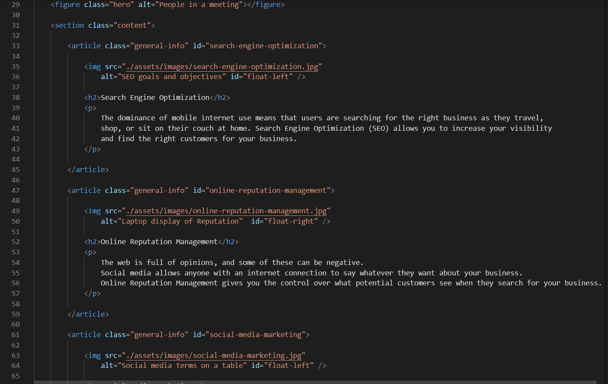

# code-refactor-horiseon

This is a refactoring assignment in which I was provided a code to refactor with HTML semantics while still enabling the site to remain the way it was intended to be; presentation and all. By working through this assignment I educated myself in using HTML semantics while also modifying the CSS to match said semantics. Exploring how the CSS works in tangent with the HTML, discovering new ways to reclassify and format things, consolidating certain code to remove redundancy, breaking the code and figuring out why and what went wrong. 

## Getting Started

Click the deployed link below to see the actual site!

## Built With

* [HTML](https://developer.mozilla.org/en-US/docs/Web/HTML)
* [CSS](https://developer.mozilla.org/en-US/docs/Web/CSS)
* [Git](https://git-scm.com/about)
* [Github](https://github.com/)

## Deployed Link

* [See Live Site](#)

## Snippet of Code

## Authors

* **Eajay Delos Santos** 

- [Link to Github](https://github.com/EajayD)
- [Link to LinkedIn](https://www.linkedin.com/in/eajay-delos-santos-912950214/)

## Acknowledgments

* I want to thank w3schools.com for providing a quick, clear, concise way of explaining various terms both in the HTML and CSS languages
* My fellow classmates for providing great discussions in study groups, allowing me to see different approaches and ideas of how to tackle and understand this assignment
* Bootcamp for giving me this opportunity to learn and develop these skills
